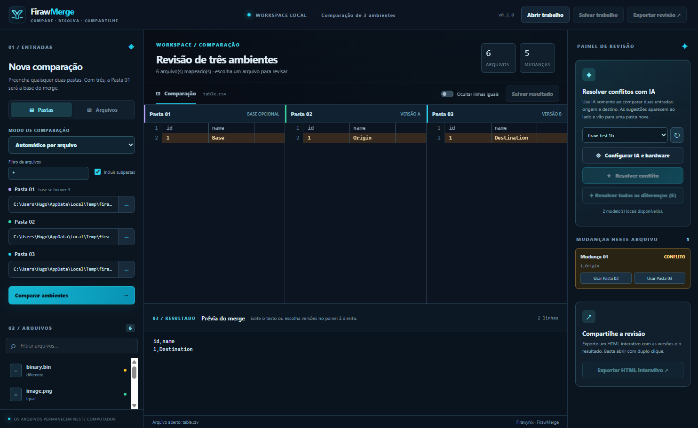

# FirawMerge

Aplicativo Windows para comparar arquivos ou pastas em dois ou três ambientes, resolver alterações e compartilhar uma revisão interativa. Identidade visual própria, no tema ciano dos projetos Firawynix.

[Site e downloads](https://firawmerge.firawynix.com.br/) · [Microsoft Store](https://apps.microsoft.com/detail/9PJZHNVKWD2Q) · [Apoiar o projeto](https://firawynix.com.br/apoie?de=firawmerge)



## Usar

1. Baixe o [instalador online](https://firawmerge.firawynix.com.br/downloads/FirawMerge-0.3.0-Online-Setup.exe) para Windows x86 ou x64. O instalador completo e as edições portáteis para cada arquitetura estão na [página do FirawMerge](https://firawmerge.firawynix.com.br/).
2. Escolha **Pastas** ou **Arquivos** e preencha quaisquer dois dos campos 01/02/03. Se preencher os três, o 01 vira a base do merge. No modo Arquivos, os rótulos passam a Arquivo 01/02/03. Para comparar URLs, escolha **Página da Web** e digite os endereços.
3. Escolha **Automático por arquivo**, **Texto**, **Tabela**, **Binário**, **Imagem** ou **Página da Web**. Depois de abrir um arquivo, o seletor permite recompará-lo em outro modo. A comparação automática reconhece CSV/TSV, formatos comuns de imagem, HTML e alguns formatos binários.
4. Em Pastas, use máscaras como `*.txt;*.csv` e marque se deseja incluir subpastas. **Ocultar arquivos iguais** filtra a lista lateral; **Ocultar linhas iguais** funciona no texto, na tabela, no hexadecimal e no código-fonte HTML.
5. **Salvar resultado** grava um arquivo novo. **Exportar HTML interativo** cria uma revisão única que outra pessoa abre com duplo clique no navegador, sem instalar o FirawMerge. A pessoa pode alternar versões, ver a sugestão original da IA separada do resultado editado, simular e baixar o arquivo escolhido. Confira o conteúdo antes de compartilhar: o HTML incorpora os arquivos alterados.
6. **Salvar trabalho** cria um arquivo `.firawmerge` com os caminhos, escolhas, resultados editados, alertas da IA e arquivo selecionado. **Abrir trabalho** recompõe a comparação a partir dos arquivos locais. Mantenha as pastas originais nos mesmos caminhos. `Ctrl+S` salva o trabalho; `Ctrl+Shift+S` salva o resultado do arquivo aberto.

## Cinco modos do menu WinMerge

| Modo | FirawMerge nesta versão |
| --- | --- |
| Texto | Diff e merge de duas ou três versões, escolha por mudança e edição do resultado. |
| Tabela | CSV e TSV em colunas, respeitando aspas, delimitadores e quebras dentro de campos; escolha por registro e edição do arquivo consolidado. |
| Binário | Prévia hexadecimal com offsets e bytes alterados; escolha e salve uma das versões completas. |
| Imagem | Visão lado a lado, sobreposição com transparência, realce por modo diferença e zoom; escolha e salve uma das versões completas. |
| Página da Web | URLs ou arquivos HTML, visualização isolada e comparação do código-fonte; salve o HTML consolidado. |

Os cinco tipos correspondem ao menu descrito no [manual de abertura do WinMerge](https://manual.winmerge.org/en/Open_paths.html). O FirawMerge tem implementação própria e não usa plugins ou binários do WinMerge.

Há um [exemplo de revisão offline](examples/revisao-exemplo.html) incluído no projeto.

## Menu do Explorador

O comando **FirawMerge** para arquivos, pastas e fundo de pastas pode ser registrado para o usuário com `shell/install-classic.ps1` e removido com `shell/uninstall-classic.ps1`. No Windows 11, o comando clássico aparece em **Mostrar mais opções**. Ele abre o aplicativo com o item selecionado no primeiro campo livre; escolha um segundo item pelo Explorador ou pelo botão `···` e clique em **Comparar ambientes**. Duas entradas podem ocupar quaisquer campos 01/02/03.

O menu principal do Windows 11 usa uma [extensão `IExplorerCommand` registrada por pacote](https://learn.microsoft.com/en-us/windows/apps/desktop/modernize/integrate-packaged-app-with-file-explorer). O instalador inclui a extensão x86/x64 e o certificado público `.cer`. Ele registra o menu clássico e, no Windows 11, importa a assinatura para **Pessoas Confiáveis** do computador e registra a extensão moderna. O Windows pede administrador para a instalação. A chave privada de assinatura não acompanha o instalador. Após instalar ou atualizar, talvez seja preciso reiniciar o Explorador de Arquivos para recarregar o menu. Para desenvolvimento sem instalador, continuam disponíveis `shell/install-classic.ps1` e `shell/install-modern.ps1`.

## Instalador online e Firawynix Center

`release/nsis-web/FirawMerge-0.3.0-Online-Setup.exe` é o instalador online universal x86/x64. Ele usa os arquivos `.nsis.7z` da mesma pasta para baixar somente a arquitetura necessária. O aplicativo instalado verifica `latest.yml` ao iniciar e depois a cada seis horas; baixa versões novas e aplica a atualização ao fechar. O Firawynix Center também usa o instalador NSIS e verifica a versão publicada antes de abrir o projeto. O instalador completo `release/FirawMerge-0.3.0-Setup.exe` funciona sem internet.

Os downloads estão publicados em `https://firawmerge.firawynix.com.br/downloads/` e a entrada `firawmerge` está no catálogo remoto do Firawynix Center. `packaging/release-links.json` registra links, tamanhos e SHA-256; `packaging/firawmerge-center-project.json` contém a entrada correspondente. Os arquivos com sufixo `mock` permanecem por compatibilidade com o fluxo anterior e agora registram os mesmos valores de produção. Rode `npm run mock:release` para recalcular hashes após cada build. Publique também o novo `latest.yml` e os dois pacotes `.nsis.7z` a cada atualização. Não publique a chave privada do certificado.

## Microsoft Store

O [FirawMerge na Microsoft Store](https://apps.microsoft.com/detail/9PJZHNVKWD2Q) usa a identidade `Firawynix.FirawMerge` (ID `9PJZHNVKWD2Q`). `npm run dist:store` gera pacotes AppX x64 e x86 em `release/store/` com a identidade do Partner Center. O build precisa do Windows SDK com `MakeAppx.exe`; quando a versão do `electron-builder` não consegue iniciar a ferramenta embutida, o script usa a instalação do SDK. Os pacotes são enviados sem assinatura local para a Store, que faz a assinatura durante a certificação. Não distribua os AppX sem essa etapa.

A edição da Store recebe atualizações pela Microsoft Store e não usa o feed `latest.yml` dos instaladores NSIS. O pacote Store atual não registra a extensão do menu principal do Explorador; para essa integração, use o instalador publicado no site. As funções de comparação, IA local, sessão salva e exportação HTML permanecem no aplicativo da Store.

## IA para conflitos

O botão **Configurar IA e hardware** lê CPU, RAM e memória dedicada da GPU. As três barras definem o orçamento usado na recomendação. A seleção de modelo é uma estimativa baseada no tamanho publicado pelo Ollama e em uma margem para execução. RAM e VRAM não são limites impostos ao serviço; a barra de CPU define a quantidade de threads enviada na chamada. O suporte efetivo da GPU depende do Ollama e do driver.

O aplicativo recomenda um modelo da família `qwen2.5-coder`. **Instalar modelo** inicia o Ollama local, se necessário, e baixa o modelo selecionado. O download só começa após esse clique. O botão de atualização da lista também pode iniciar o Ollama para mostrar modelos já instalados. Apenas modelos instalados localmente são listados para resolução; o conteúdo do arquivo é enviado somente para `127.0.0.1:11434`.

A IA só pode ser acionada para arquivos de texto, tabela e HTML com diferença entre **duas entradas**, origem e destino. Em três entradas, o merge é manual. A sugestão da IA aparece em uma coluna ao lado das versões. **Resolver todas as diferenças** processa em sequência os arquivos pendentes, mostra o progresso e permite cancelar. Arquivos de imagem e binários, arquivos grandes demais e falhas são registrados como ignorados. Resoluções que você já editou são preservadas. O lote cria uma única pasta em `Documentos/FirawMerge/Resolvidos/Lote-<data-id>/`, com os resultados e `REVISAO.txt`; o botão individual continua criando uma pasta por arquivo. Nenhuma origem é substituída. O aplicativo alerta sobre resultado vazio ou interrompido no limite de geração, JSON inválido, marcadores de conflito, perda de trechos iguais e alguns comandos destrutivos introduzidos. Os alertas e a sugestão original acompanham o resultado no HTML exportado. Essas verificações são heurísticas; revise cada resultado antes de executar ou publicar.

## Limites desta versão

- Texto, tabela e HTML: UTF-8 ou UTF-16 LE até 2 MB por arquivo. Binário e imagem: até 8 MB por arquivo; hexadecimal mostra os primeiros 64 KB. Outras codificações não têm editor nesta versão.
- Comparação de pastas até 20.000 arquivos; links simbólicos não são seguidos.
- O relatório HTML inclui arquivos alterados e tem limite de 30 MB de dados. Não contém arquivos iguais. No modo Página da Web, o HTML exportado guarda o código-fonte capturado; scripts e recursos externos são bloqueados na prévia offline.
- As funções mais avançadas do manual ainda não têm paridade: edição byte a byte, detecção visual por blocos e limiar de cor, imagens multipágina/PDF, árvore de recursos e capturas de página web e filtros por expressão. Veja a [matriz detalhada](docs/COBERTURA-WINMERGE.md).
- A assinatura incluída é local/autogerada. Outra máquina precisa confiar no `.cer` para registrar o menu moderno e validar atualizações. O certificado vence em 24/09/2027; planeje a renovação antes de publicar atualizações após essa data.

## Desenvolvimento

Requer Node.js e npm. O projeto usa Electron 43 para manter suporte a Windows x86.

```powershell
npm install
npm start
npm test
npm run smoke
npm run smoke:viewer
npm run dist:all
npm run dist:install
npm run dist:online
npm run dist:store
npm run mock:release
```

O WinMerge instalado em `C:\Program Files\WinMerge` e seu [manual](https://manual.winmerge.org/en/) serviram como referência funcional. O [código oficial do WinMerge](https://github.com/WinMerge/winmerge) é GPL-2.0; este projeto não incorpora código, marcas ou recursos binários do WinMerge. O código original do FirawMerge é MIT.
